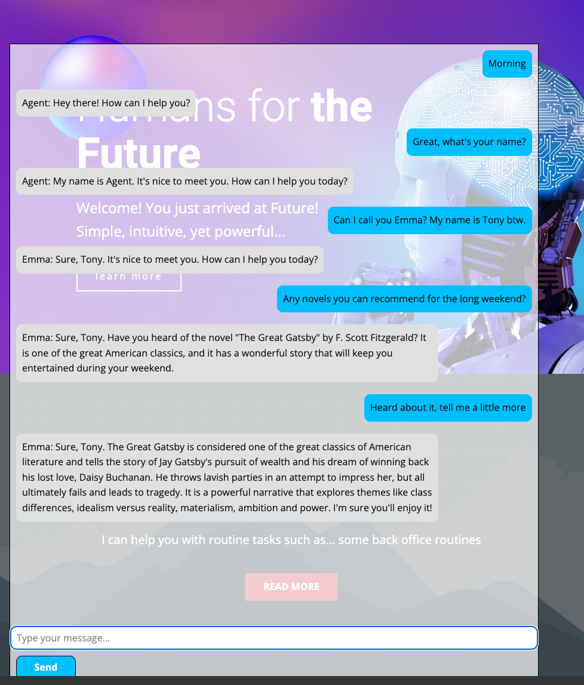

# ChatGPT-like backend demo implementation using OpenAI's GPT API's


**Author: T. Tong <ttong@pro-ai.org>**

Follow me on: 
[Medium](https://medium.com/@tonytong.ai)
[Twitter](https://twitter.com/GoProAI)
[LinkedIn](https://www.linkedin.com/in/ttong/)


In `agent.models_openai.py`, you will need to supply your own OPEN_API_KEY

```python
openai.api_key = os.getenv("OPENAI_API_KEY", "<YOUR_OPEN_API_KEY>")
```



